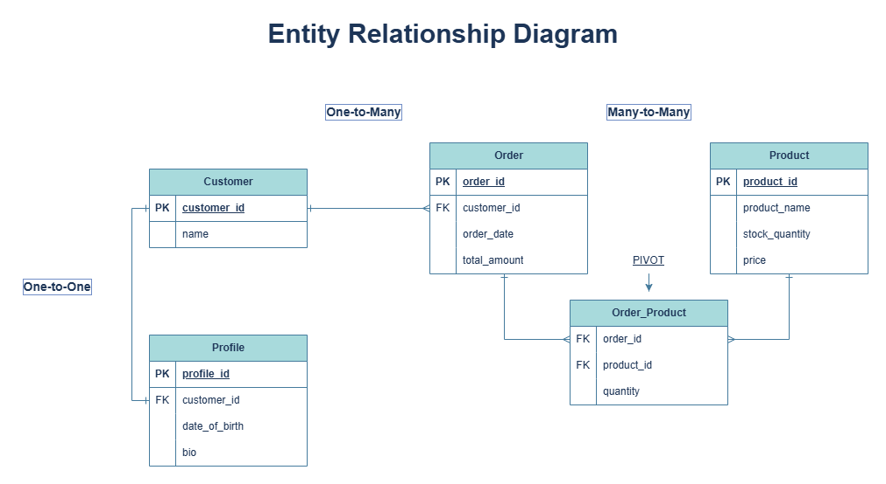

# Laravel ERD Project: E-Commerce Database Implementation

This repository contains a Laravel-based implementation of a relational database schema. The project demonstrates the use of Eloquent relationships, including One-to-One, One-to-Many, and a Many-to-Many relationship using an associative entity (Pivot table).

## 📊 Entity Relationship Diagram (ERD)

 
*(Note: Ensure the filename above matches the image file you upload to GitHub)*

---

## 🛠️ Database Logic & Relationships

### 1. One-to-One: Customer & Profile
* **Logic:** Each Customer is linked to exactly one Profile.
* **Implementation:** The `profiles` table contains a `customer_id` with a **Unique Constraint** to prevent duplicate profiles for a single user.
* **Eloquent:** `Customer` hasOne `Profile` | `Profile` belongsTo `Customer`.

### 2. One-to-Many: Customer & Order
* **Logic:** A single Customer can place multiple Orders, but each Order belongs to only one Customer.
* **Implementation:** The `orders` table holds the `customer_id` foreign key.
* **Eloquent:** `Customer` hasMany `Order` | `Order` belongsTo `Customer`.

### 3. Many-to-Many: Order & Product (Associative Entity)
* **Logic:** An Order can contain multiple Products, and a Product can be part of multiple Orders.
* **Associative Data:** To make the system functional for a real-world shop, I have added a **`quantity`** attribute to the pivot table (`order_product`). This allows the system to track how many units of a specific product were purchased in a single order.
* **Eloquent:** Both models use `belongsToMany` with the `->withPivot('quantity')` method.

---

## 🚀 Key Files to Review

* **Migrations:** `database/migrations/`
    * `create_customers_table.php`
    * `create_profiles_table.php`
    * `create_orders_table.php`
    * `create_products_table.php`
    * `create_order_product_table.php` (Pivot Table)
* **Models:** `app/Models/`
    * `Customer.php`
    * `Profile.php`
    * `Order.php`
    * `Product.php`
